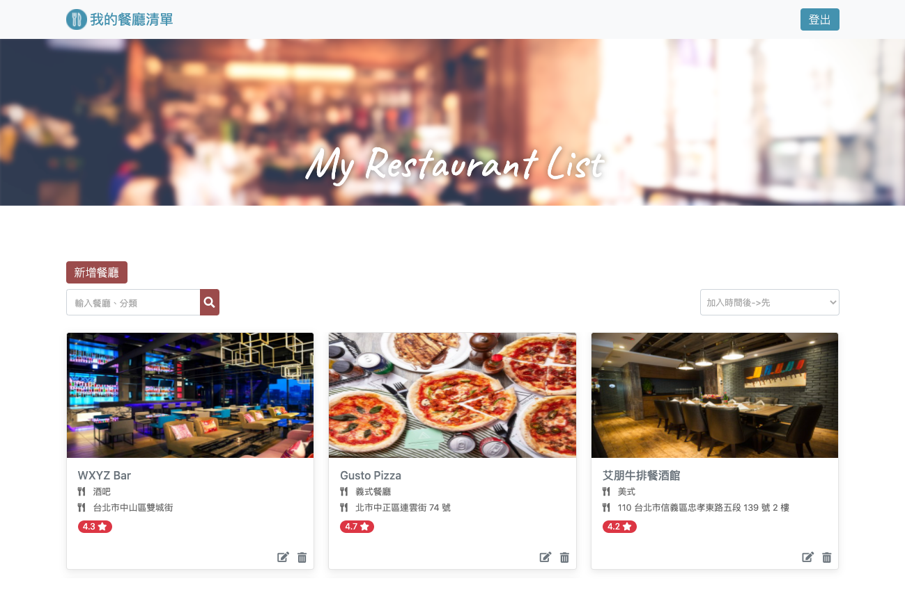

# Restaurant List
A user authentication & CRUD web application build with `node.js`. 
- web server: `express`
- view engine: `handlebars`
- database: `mongodb` with `mongoose` as ODM


## Features
- **Register**: User is able to register an account with email or Facebook account
- **Login / Logout**: User is able to login and logout 
- **Create**: User is able to create new restaurant to the list.
- **Read**: User is able to click on the picture to see restaurant information.
- **Update**: User is able to edit restaurant information.
- **Delete**: User is able to delete restaurant from the list.
- **Search**: User is able to search with restaurant name or restaurant category.
- **Sort**: User is able to sort the restaurant list.



## Quick Start
1. Install server depenencies
```
npm install
```
2. Write seed data to database
```
npm run seed
```
3. Run server with nodemon
```
npm run dev
```
4. Browse with browser
```
http://localhost:3000
```
5. Register or try with below accounts:
User 1:
```
email: user1@example.com
password: 12345678
```

User 2:
```
email: user2@example.com
password: 12345678
```
